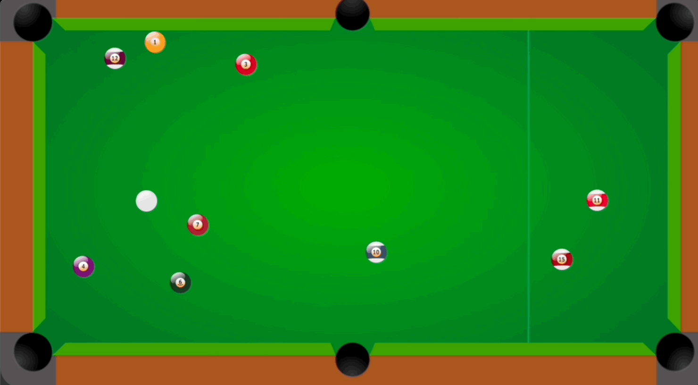

# billiards-rl
This is the final project repository for the Spring 2023 Decision making Under Uncertainty course at the University of Colorado - Boulder. This project tests how an agent can learn to shoot one or more billiards ball(s) into a pocket using reinforcement learning.

